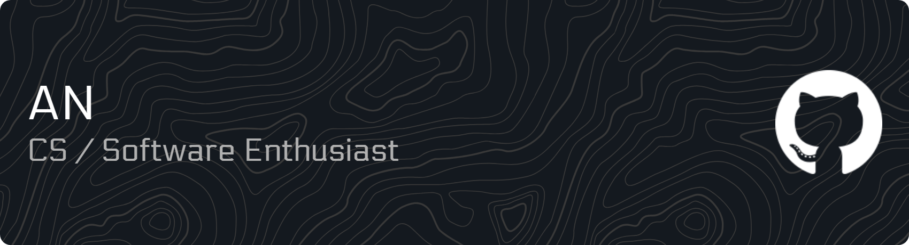

## 💻 Student • Backend & Graphics / Software Enthusiast

### 🧠 Languages
C • C++ • Rust • Java • Javascript • SQL • GLSL • HTML • CSS

### 🧰 Frameworks & Platforms
React • Electron • Vite • Supabase • WinUI3/WinRT • Tokio • n8n

### 🗂 Databases
PostgreSQL

### 🧱 Libraries
GLFW • GLM • Glad • STB • ImGui • SpdLog • Other 

### 🛠 Developer Tools
Git • Cargo • Rustup • Docker • Bash • PowerShell • VS Code • Visual Studio • IntelliJ • CLion • Jira • Linear

### 🎮 Interests
Graphics programming • Engine systems • Backend systems • Automation workflows
